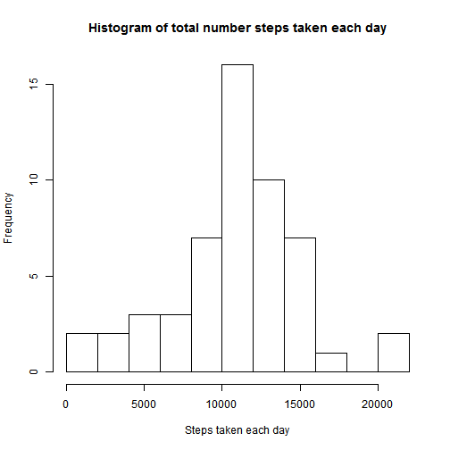
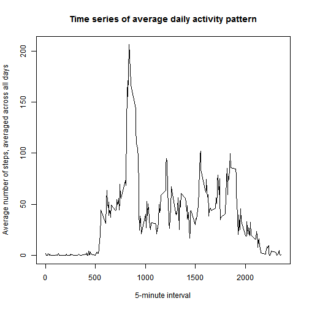
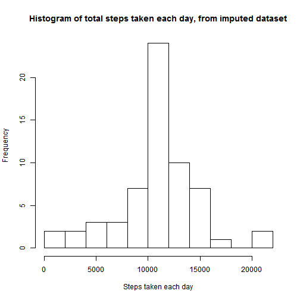

# Reproducible Research: Peer Assessment 1
        Student: Ahmed Mustakim
        Date   : July 17, 2014

Set global options for code chunk:

```r
opts_chunk$set(echo=TRUE)
```


## Loading and preprocessing the data

1) First, I loaded the data from the zipped file, in the git repository:

```r
setwd("C:/Users/AhmedToshiba/Documents/GitHub/RepData_PeerAssessment1") #local Git repo
activity <- read.csv(unz("activity.zip", "activity.csv"), 
                     header=TRUE, 
                     na.strings="NA" )
```

2) Based on the field definition, let's do some data type conversion:

```r
activity$steps <- as.numeric(activity$steps)
activity$date <- as.Date(activity$date)
activity$interval <- as.numeric(activity$interval)
```

3) The data is now in a data frame called ***activity*** and here are the first 5 rows:

```r
head(activity,5)
```

```
##   steps       date interval
## 1    NA 2012-10-01        0
## 2    NA 2012-10-01        5
## 3    NA 2012-10-01       10
## 4    NA 2012-10-01       15
## 5    NA 2012-10-01       20
```

## What is mean total number of steps taken per day?

1) First I need to ignore the missing values in the data set:

```r
activityComplete <- activity[complete.cases(activity),]
```

2) Then I need to compute the number of steps taken each day:

```r
library(plyr)
stepsPerDay <- ddply(activityComplete[c(1,2)], 
                     .(date), 
                     colwise(sum) ) #aggregate on steps and group by date
```

and here's what the first 5 row of that intermediate data looks like:

```r
head(stepsPerDay,5)
```

```
##         date steps
## 1 2012-10-02   126
## 2 2012-10-03 11352
## 3 2012-10-04 12116
## 4 2012-10-05 13294
## 5 2012-10-06 15420
```


3) Then I can make the histogram of the total number of steps taken each day:

```r
hist(stepsPerDay$steps,
     main="Histogram of total number steps taken each day", 
     xlab="Steps taken each day", 
     breaks=10)
```

 

4) Finally, I can calculate and report the mean and median total number of steps taken per day:

```r
summary(stepsPerDay$steps)[c("Mean","Median")]
```

```
##   Mean Median 
##  10800  10800
```

## What is the average daily activity pattern?

1) First I need to compute the average number of steps taken, across all days :

```r
library(plyr)
averageSteps <- ddply(activity[c(1,3)], .(interval), colwise(mean), na.rm=TRUE ) 
```

and let's preview the data to make sure it looks ok:

```r
head(averageSteps, 5)
```

```
##   interval   steps
## 1        0 1.71698
## 2        5 0.33962
## 3       10 0.13208
## 4       15 0.15094
## 5       20 0.07547
```


2) Now I can make that time series plot of the 5-minute interval (x-axis) vs average number of steps taken, averaged across all days (y-axis):

```r
plot(averageSteps$interval, 
     averageSteps$steps, 
     type="l" ,
     main="Time series of average daily activity pattern", 
     xlab="5-minute interval", 
     ylab="Average number of steps, averaged across all days")
```

 

3) The 5-minute interval, on average across all the days in the data set, which contains the maximum number of steps:

```r
averageSteps$interval[which.max(averageSteps$steps)]
```

```
## [1] 835
```


## Imputing missing values
1) Calculate the  the total number of rows with NAs in the data set:

```r
table(complete.cases(activity$steps))[c("FALSE")][[1]]
```

```
## [1] 2304
```

2) Fill in all missing values by using the mean of the day:

```r
imputeMean <- function(s) {
  replace(s, is.na(s), mean(s, na.rm = TRUE))  
} 
```

                     
3) Create a new data set with the missing data filled in and let's preview that data set:

```r
library(plyr)
#fill in missing values 
activityImputed <- ddply(activity[1:3], 
                         .(interval), 
                         transform,
                         steps = imputeMean(steps),
                         date = date,
                         interval = interval
                         )

# sort by date and interval
activityImputed <- activityImputed[order(activityImputed$date,
                                         activityImputed$interval),]

# renumber rownames
row.names(activityImputed) <- 1:nrow(activityImputed)

# preview data
head(activityImputed,5)
```

```
##     steps       date interval
## 1 1.71698 2012-10-01        0
## 2 0.33962 2012-10-01        5
## 3 0.13208 2012-10-01       10
## 4 0.15094 2012-10-01       15
## 5 0.07547 2012-10-01       20
```

4) Make a histogram of the total number of steps taken each day from the new data set:

```r
library(plyr)
# aggregate on steps and group by date
imputedStepsPerDay <- ddply(activityImputed[c(1,2)], 
                     .(date), 
                     colwise(sum) ) 
# create histogram based on aggregated data
hist(imputedStepsPerDay$steps,
     main="Histogram of total steps taken each day, from imputed dataset", 
     xlab="Steps taken each day", 
     breaks=10)
```

 

5) Calculate the mean and median total number of steps taken per day: 

```r
summary(imputedStepsPerDay$steps)[c("Mean","Median")]
```

```
##   Mean Median 
##  10800  10800
```

6) Do these values differ from the estimates from the first part of the assignment: 
**No**

7)What is the impact of imputing missing data on the estimates of the total daily number of steps:
**More frequent steps taken per day in each step bin, as a result of the imputed dataset (evident from the new histogram).**

## Are there differences in activity patterns between weekdays and weekends?

1) Create a new factor variable indicating "weekday" and "weekend":

```r
#create weekday column
activityImputed$day <- "weekday"
    
#set value to weekend where appropriate 
activityImputed[weekdays(as.Date(activityImputed$date)) %in% c("Saturday","Sunday"), 4] <- "weekend"

#convert to factor
activityImputed$day <- as.factor(activityImputed$day)
```


2) Make 2 time series plots of the 5-minute interval (x-axis) vs average number of steps taken, averaged across all weekday days or weekend days (y-axis):

```r
#First create the average series
library(plyr)
averageWDSteps <- ddply(activityImputed[c(1,3, 4)], 
                        .(interval, day), 
                        colwise(mean), 
                        na.rm=TRUE ) 

#create plot
library(lattice)
xyplot(steps ~ interval | day, 
       layout=c(1,2), 
       data = averageWDSteps, 
       type="l", 
       ylab="Number of steps",
       xlab="Interval")
```

 
